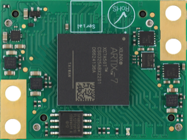
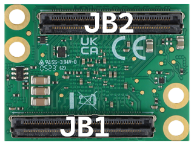
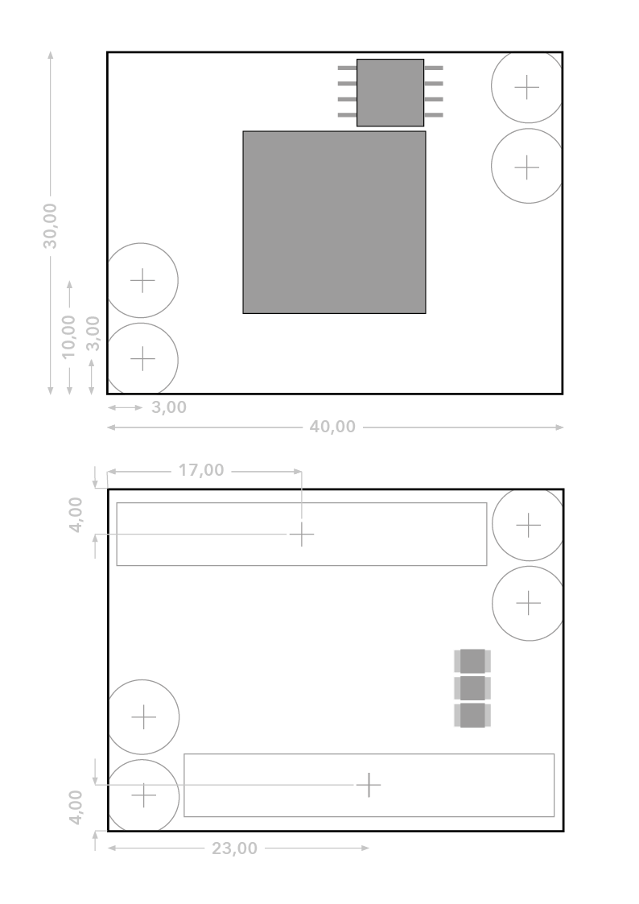
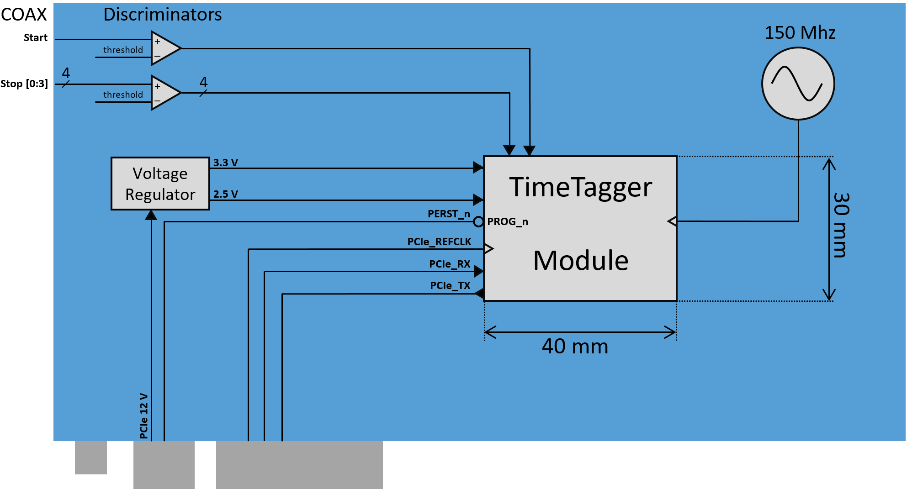

.. role:: raw-html(raw)
    :format: html

.. role:: raw-latex(raw)
    :format: latex

Hardware
========

Overview
--------

.. _fig top:

    Top-view of a TimeTagger Module.

.. _fig bottom:

.. _fig underneath:

    Bottom-view of a TimeTagger Module. For the pin assignment of connectors
    JB1 and JB2, see :numref:`Section %s<pin assignment>`.

:numref:`Figures %s<fig top>` and :numref:`%s<fig bottom>` show the top and
bottom view of the module.

The TimeTagger Module is connected to a carrier board using two 
B2B connectors Samtec Razor Beam\ :sup:`TM` LSHM-150 (JB1, JB2).
:numref:`Figure %s<fig connector placement>` shows the dimensions of the
board as well as the positioning of the two B2B connectors.

.. _fig connector placement:

    Dimensions of the module and placement of the B2B connectors and mounting
    holes. All dimensions are in mm. Mating height with a standard connector
    is 8 mm.

.. _sec io:

Inputs and Outputs
------------------

.. _fig io diagram:

.. figure:: _static/diagram.*
    :alt: Block Diagram
    :width: 50%

    Block diagram giving an overview of the inputs and outputs of the
    TimeTagger Module, respectively.

:numref:`Figure %s<fig io diagram>` gives an overview of the required and
optional input and output signals of the TimeTagger Module. The required
standards are listed in :numref:`Section %s<sec signal standard>`.

Input Voltages
^^^^^^^^^^^^^^

**VCC33** and **VCC25**
    Input Voltages of 3.3 V and 2.5 V.

Clocking
^^^^^^^^

**PCIe_100M_CLK**
    A differential 100 MHz clock that complies with PCIe clock specifications
    with regards to signaling levels and jitter.

    This must be synchronous to the clock of the PCIe host connected to the
    module. It can be taken directly from the clock of a PCIe_CEM connector.

    100 nF decoupling capacitors should be placed in series of this signal to
    implement AC coupling.

**TDC_150M_CLK**
    A differential LVDS clock signal with 150 MHz freqeuency. This can be
    either synchronous or asynchronous to PCIe_100M_CLK.

    The quality of this clock effects the measurement accuracy of the TDC, so
    a low-jitter clock source must be used. Spread-spectrum clocking should be
    disabled for this signal.

Main Signals
^^^^^^^^^^^^
All these signals must be correctly connected to operate the TimeTagger
Module.

**PROG_n**
    3.3 V CMOS input.

    Strobe LOW for at least **XXX???** to initiated reloading of the FPGA
    firmware.

    In a PCIe-CEM system this should be connected to the PERST_n pin of the
    connector and provided with a 5 kΩ pull-up to 3.3 V.
    When connected to 3.3 V, the firmware is only loaded once at power-up.

**PERST_n**
    3.3 V CMOS input.

    Reset the PCIe core of the FPGA.

    In a PCIe_CEM system, this should be connected to the corresponding signal
    from the edge connector. In an embedded system the requirements can vary,
    but it could be controlled my a microcontroller output.

    Timing should comply to the PCIe_CEM specification. 

**PCIe_TX[3:0]**
    Differential PCIe output signals to transmit packets from the
    TimeTagger Module to the host. Compliant to PCIe standards.
    The _P and _N signals of each pair can be flipped to simplify routing.

    The PCIe protocol will detect and correct the inversion.

    Lanes 0 to 3, or lanes 0 and 1, or only lane 0 can be connected to the
    host. The ordering of lanes can be reversed to simplify routing. 

**PCIe_RX[3:0]**
    Same as PCIe_TX but an input for receiving packets from the host at the
    module.
    100 nF decoupling capacitors must be placed in series to these signals.

**START**
    Differential LVDS input to start a TDC measurement. If single ended
    signals or small scale signals shall be processed, a discriminator must be
    implemented.

    This signal must not be left floating and should always be in a well
    defined LOW or HIGH state.

**STOP[3:0]**
    Differential LVDS input to create a time measurement on the respective
    channel.

    This signal must not be left floating and should always be in a well
    defined LOW or HIGH state.

Optional Signals
^^^^^^^^^^^^^^^^
These signals are not necessary for operating the module, but they can provide
useful additional features.

.. attention::

    Even when not in use, some of the optional signals must be correctly
    connected as described for each individual signal. Others can be left open.

**PCIe_SMCLK, PCIe_SMDAT**
    3.3 V CMOS signals for system management bus.

    Currently not supported by the driver and firmware.

    Can be connected to the corresponding signals on a PCIe_CEM connector
    with the 470 Ω series resistor or can be left floating.

**JTAG signals**
    The JTAG port for debugging, reflashing and interactive development of
    the FPGA hardware. This usually is not required for a production system,
    as the firmware delivered with the module provides the capability to
    update the firmware over PCIe.

    However, we recommend to implement a JTAG connector anyway if space is
    available, to simplify debugging of the base board.

    There are various JTAG cables for FPGA development available.
    The following circuit is compatible to the cables provide by
    Trenz Electronic.

    [TODO Link zum Kabel und Kabelbezeichnung einfügen]

    [TODO Schaplanausschnitt rund um J13 des Schaltplans einfügen]

    **JTAG_TDI**
        3.3 V CMOS input.

        Data from the JTAG controller to the FPGA.

    **JTAG_TDO**
        3.3 V CMOS output.

        Data from the FPGA to the JTAG controller. 

    **JTAG_TMS**
        3.3 V CMOS input.

        Control signal from the JTAG controller to the FPGA.

    **JTAG_TCK**
        3.3 V CMOS intput.

        Clock signal from the JTAG controller to the FPGA. 

        If JTAG is used, a 50 Ω termination close to the FPGA module is
        required.

        Otherwise, if JTAG is not used, this signal must be tied to GND
        or 3.3 V.

**Status Signals**
    There are four signals provided that can be used to provide information
    about the module status.

    In the original TimeTagger4 base boards, these signals are connected to
    LEDs to provide visual feedback to the user. In an embedded system they
    could alternatively be connected to microcontroller inputs.

    **DONE**
        3.3 V CMOS output.

        A high value indicates that the FPGA completed configuration.
        cronologic usually connects this to a red LED over a 220 Ω series
        resistor.

        The LED is lighting up during configuration so that a failed
        configuration is immediately visible.

    **STAT_INITIALIZED**
        3.3 V CMOS output.

        Is set to HIGH after the board is initialized by the driver.
        Is reset to LOW when the device is closed by the software.

    **STAT_CAPTURE[1:0]**
        3.3 V CMOS output.

        Provide status information. These can be connected to 3.3 V via
        120 Ω series resistor and an LED.  

        STAT_CAPTURE[0] is set HIGH when the driver is in the capturing state.

        Then, STAT_CAPTURE[1] becomes HIGH when a first start pulse is
        detected during capturing.

        These bits are sticky and stay HIGH until capturing is stopped,
        with one exception: If missing groups are detected, STAT_CAPTURE[0]
        becomes LOW and STAT_CAPTURE[1] becomes HIGH.

        These pins can be connected to a dual-color LED that lights up, e.g.,
        green when capture is started, yellow when start signals are detected,
        and red when groups are missing. For this STAT_CAPTURE[0] should
        light up the green LED and STAT_CAPTURE[1] should light up the
        red LED.

**TiGer Signals**
    **TiGer[4:0]**
        3.3 V CMOS output.

        These pins are controlled by the TiGer timing generator. They can be
        used to control the timing of the system with high precision. 

    **TiGer_OE[4:0]**
        3.3 V CMOS output. Output Enable for the TiGer.

        On cronologic's TimeTagger4 boards, the connectors for the TiGer
        outputs are shared with the TDC inputs.

        To facilitate this, tristate buffers close to the connector are used to
        conditionally drive the TiGer signals to the connector.

        The buffers are enabled when TiGer_OE is HIGH. In an embedded system
        the TiGer signals usually can be routed directly to their sinks and
        the output enables can be left unconnected.

**DAC Control**
    The driver for the module supports controlling of two DAC8565
    digital-to-analog converters to configure the input thresholds of the
    discriminators and the oscillator control voltage.

    In an embedded system, the same setup can be used. Alternatively, the
    voltages can be controlled by a microcontroller or set to fixed voltages.
    [TODO Link zur Herstellerseite des DACs]

    DAC1 has OSC_VC on VOUTA and the discriminator threshold of the START
    input on VOUTD.

    DAC2 has the discriminator thresholds of the for stop channels on its
    VOUTx outputs.

    DAC3 is not supported yet. The enable is provided to allow future
    versions with more channels. 

    It is possible to change the meaning of the voltages. For example,
    VOUTD of DAC1 can be used as a common threshold for all inputs.
    But the driver will not know that and this voltage will be accessed by
    the user as the START channel threshold.

    **DAC_SYNC**
        3.3 V CMOS output.

        Connect to the
        :raw-latex:`$\overline{\text{SYNC}}$`\
        :raw-html:`<overline>SYNC</overline>`
        pins of the DACs. Avoid stubs.

    **DAC_SCLK**
        3.3 V CMOS output.

        Connect to the SCLK pins of the DACs. Avoid stubs.

    **DAC_D**
        3.3 V CMOS output.

        Connect to the DIN pins of the DACs. Avoid stubs.

    **DAC_RST_b**
        3.3 V CMOS output.

        Connect to the
        :raw-latex:`$\overline{\text{RST}}$`\
        :raw-html:`<overline>RST</overline>`
        pins of the DACs. Avoid stubs.

    **DAC_EN**
        3.3 V CMOS output.

        Connect to the
        :raw-latex:`$\overline{\text{ENABLE}}$`\
        :raw-html:`<overline>ENABLE</overline>`
        pin of the DAC with the same index.

**BOARD[3:0]**
    3.3 V CMOS output.

    A bit pattern of 4 bits that is made visible in the driver API.

    Can be used to communicate version or type information about the base
    board to the software, in case it has to act differently for certain
    variants.

**TEMP_ALARM_b**
    3.3 V CMOS output.

    When set to LOW, the driver will report a temperature alarm. Can be
    connected to the alarm output of a temperature sensor, to a
    microcontroller, or can be connected to 3.3 V.

**POWON**
    3.3 V CMOS output.

    This signal is set to HIGH after all power supplies of the module are
    stable and the FPGA on the module is configured.

    It can be used to enble power supply circuits that are not required to
    supply the TDC module.

Routing of Differential Signals
-------------------------------

All differential signals on the board are high speed signals that must be
routed carefully to provide good signal integrity.

The routing can either be done as a coupled pair with 100 Ω differential
impedance or as two independent wires with 50 Ω single ended impedance.

An uninterupted reference plane should be on the next layer along the whole
stretch of the connection. Stubs and branches must be avoided.

All differential inputs are terminated on the board with 100 Ω differential
termination. 

.. _sec signal standard:

Signal Standards
----------------

The superscript next to the signal names of the tables in
:numref:`Sections %s<jb1 table>` and :numref:`%s<jb2 table>` refer to the
signal standard, as listed below.

:sup:`1`\ PCIe
    Differential signals with an impedance of 100 Ω compliant with the
    PCIe_CEM standard.

:sup:`2`\ LVCMOS33
    For input signals, V\ :sub:`IL` and V\ :sub:`IH` specify the 
    input voltage for LOW and HIGH, respectively.

    For output signals, V\ :sub:`OL` and V\ :sub:`OH` specify the output
    voltage of LOW and HIGH, respectively.
    
.. table::
    :width: 100%

    +------------------+------------------+------------------+------------------+------------------+------------------+
    | V\ :sub:`IL,min` | V\ :sub:`IL,max` | V\ :sub:`IH,max` | V\ :sub:`IH,max` | V\ :sub:`OL,max` | V\ :sub:`OH,min` | 
    +==================+==================+==================+==================+==================+==================+
    | −0.3 V           | 0.8 V            | 2.0 V            | 3.45 V           | 0.4 V            | 2.9 V            |
    +------------------+------------------+------------------+------------------+------------------+------------------+

:sup:`3`\ LVDS
    V\ :sub:`IDIFF` is the differential input voltage (U - Ū), where U is HIGH
    [or (Ū - U), where Ū is HIGH]. The input impedance is 100 Ω differential.

.. table::
    :width: 100%

    +-----------------+-----+---------+-----+------+
    | Symbol          | Min | Typical | Max | Unit |
    +=================+=====+=========+=====+======+
    | V\ :sub:`IDIFF` | 100 | 350     | 600 | mV   |
    +-----------------+-----+---------+-----+------+ 
    | V\ :sub:`ICM`   | 0.3 | 1.2     | 1.5 | V    |
    +-----------------+-----+---------+-----+------+

:sup:`4`\ VCC33
    min. 3.2 V; max 3.4 V

:sup:`5`\ VCC25
    min. 2.4 V; max 2.6 V

.. _pin assignment:

Pin Assignment
--------------

.. warning::

    This user guide is under development. The Pin-Assignment below is subject
    to change.

The tables in :numref:`Sections %s<jb1 table>` and :numref:`%s<jb2 table>` list
the pin assignments of connectors JB1 and JB2 (see
:numref:`Figure %s<fig underneath>`).

Pins without labels are unused. Some signals are optional and do not have to 
be connected, as is described in :numref:`Section %s<sec io>`.

Pins that must not be connected are marked as DNC.

.. _jb1 table:

Connector JB1
^^^^^^^^^^^^^

Pin assignment of the JB1 connector. The superscripts refer to the signal
standard (see :numref:`Section %s<sec signal standard>`)

.. raw:: latex

    \begingroup
    \small

.. tabularcolumns:: |R|L|L|L|C|R|L|L|L|

.. table::
    :width: 100%

    +----------------------------+-----+-----+------------------------------++-----------------+-----+-----+----------------------------+
    | Name                       | Pin | Pin | Name                         || Name            | Pin | Pin |  Name                      |
    +============================+=====+=====+==============================++=================+=====+=====+============================+
    | PCIe_RX3_P\ :sup:`1`       |  1  |  2  | PCIe_100M_CLK_P\ :sup:`1`    ||                 | 51  | 52  |                            |
    +----------------------------+-----+-----+------------------------------++-----------------+-----+-----+----------------------------+
    | PCIe_RX3_N\ :sup:`1`       |  3  |  4  | PCIe_100M_CLK_N\ :sup:`1`    ||                 | 53  | 54  | DAC_EN2\ :sup:`2`          |
    +----------------------------+-----+-----+------------------------------++-----------------+-----+-----+----------------------------+
    |  GND                       |  5  |  6  | GND                          ||                 | 55  | 56  | DAC_RST\ :sup:`2`          |
    +----------------------------+-----+-----+------------------------------++-----------------+-----+-----+----------------------------+
    | PCIe_RX2_P\ :sup:`1`       |  7  |  8  | PCIe_TX3_P\ :sup:`1`         ||                 | 57  | 58  | DAC_D\ :sup:`2`            |
    +----------------------------+-----+-----+------------------------------++-----------------+-----+-----+----------------------------+
    | PCIe_RX2_N\ :sup:`1`       |  9  | 10  | PCIe_TX3_N\ :sup:`1`         ||                 | 59  | 60  | DAC_SCLK\ :sup:`2`         |
    +----------------------------+-----+-----+------------------------------++-----------------+-----+-----+----------------------------+
    |  GND                       | 11  | 12  | GND                          || VCC33\ :sup:`4` | 61  | 62  | DAC_EN1\ :sup:`2`          |
    +----------------------------+-----+-----+------------------------------++-----------------+-----+-----+----------------------------+
    | PCIe_RX1_P\ :sup:`1`       | 13  | 14  | PCIe_TX2_P\ :sup:`1`         ||                 | 63  | 64  | DAC_SYNC\ :sup:`2`         |
    +----------------------------+-----+-----+------------------------------++-----------------+-----+-----+----------------------------+
    | PCIe_RX1_N\ :sup:`1`       | 15  | 16  | PCIe_TX2_N\ :sup:`1`         ||                 | 65  | 66  | GND                        |
    +----------------------------+-----+-----+------------------------------++-----------------+-----+-----+----------------------------+
    |  GND                       | 17  | 18  | GND                          ||                 | 67  | 68  |                            |
    +----------------------------+-----+-----+------------------------------++-----------------+-----+-----+----------------------------+
    | PCIe_RX0_P\ :sup:`1`       | 19  | 20  | PCIe_TX1_P\ :sup:`1`         ||                 | 69  | 70  |                            |
    +----------------------------+-----+-----+------------------------------++-----------------+-----+-----+----------------------------+
    | PCIe_RX0_N\ :sup:`1`       | 21  | 22  | PCIe_TX1_N\ :sup:`1`         ||                 | 71  | 72  |                            |
    +----------------------------+-----+-----+------------------------------++-----------------+-----+-----+----------------------------+
    |  GND                       | 23  | 24  | GND                          ||                 | 73  | 74  |                            |
    +----------------------------+-----+-----+------------------------------++-----------------+-----+-----+----------------------------+
    |                            | 25  | 26  | PCIe_TX0_P\ :sup:`1`         ||                 | 75  | 76  |                            |
    +----------------------------+-----+-----+------------------------------++-----------------+-----+-----+----------------------------+
    | GND                        | 27  | 28  | PCIe_TX0_N\ :sup:`1`         ||                 | 77  | 78  |                            |
    +----------------------------+-----+-----+------------------------------++-----------------+-----+-----+----------------------------+
    | GND                        | 29  | 30  | GND                          ||                 | 79  | 80  |                            |
    +----------------------------+-----+-----+------------------------------++-----------------+-----+-----+----------------------------+
    | PCIe_SMCLK\ :sup:`2`       | 31  | 32  | TiGer_STOP1_OE\ :sup:`2`     ||                 | 81  | 82  | STAT_INITIALIZED\ :sup:`2` |
    +----------------------------+-----+-----+------------------------------++-----------------+-----+-----+----------------------------+
    | PCIe_SMDAT\ :sup:`2`       | 33  | 34  | TiGer_STOP2\ :sup:`2`        || 3.3 V Testpin   | 83  | 84  | GND                        |
    +----------------------------+-----+-----+------------------------------++-----------------+-----+-----+----------------------------+
    | DNC                        | 35  | 36  | TiGer_STOP1\ :sup:`2`        ||                 | 85  | 86  | JTAG_TDI\ :sup:`2`         |
    +----------------------------+-----+-----+------------------------------++-----------------+-----+-----+----------------------------+
    | DNC                        | 37  | 38  | TiGer_STOP2_OE\ :sup:`2`     ||                 | 87  | 88  | JTAG_TDO\ :sup:`2`         |
    +----------------------------+-----+-----+------------------------------++-----------------+-----+-----+----------------------------+
    | TiGer_STOP0_OE\ :sup:`2`   | 39  | 40  | TiGer_STOP3\ :sup:`2`        || BOARD0          | 89  | 90  | JTAG_TCK\ :sup:`2`         |
    +----------------------------+-----+-----+------------------------------++-----------------+-----+-----+----------------------------+
    | TiGer_START_OE\ :sup:`2`   | 41  | 42  | TiGer_STOP3_OE\ :sup:`2`     || BOARD1          | 91  | 92  | JTAG_TMS\ :sup:`2`         |
    +----------------------------+-----+-----+------------------------------++-----------------+-----+-----+----------------------------+
    | TiGer_STOP0\ :sup:`2`      | 43  | 44  |                              || BOARD2          | 93  | 94  |  PROG_n\ :sup:`2`          |
    +----------------------------+-----+-----+------------------------------++-----------------+-----+-----+----------------------------+
    | TiGer_START\ :sup:`2`      | 45  | 46  |                              || BOARD3          | 95  | 96  |  DONE\ :sup:`2`            |
    +----------------------------+-----+-----+------------------------------++-----------------+-----+-----+----------------------------+
    | GND                        | 47  | 48  |  GND                         || VCC33\ :sup:`4` | 97  | 98  |   GND                      |
    +----------------------------+-----+-----+------------------------------++-----------------+-----+-----+----------------------------+
    | PERST_n\ :sup:`2`          | 49  | 50  |                              || VCC33\ :sup:`4` | 99  | 100 |  GND                       |
    +----------------------------+-----+-----+------------------------------++-----------------+-----+-----+----------------------------+
    |                            |     |     |                              ||  GND            | F1  | F2  |   GND                      |
    +----------------------------+-----+-----+------------------------------++-----------------+-----+-----+----------------------------+

.. raw:: latex

    \endgroup

.. _jb2 table:

Connector JB2
^^^^^^^^^^^^^

Pin assignment of the JB1 connector. The superscripts refer to the signal
standard (see :numref:`Section %s<sec signal standard>`)

.. raw:: latex

    \begingroup
    \small

.. tabularcolumns:: |R|L|L|L|C|R|L|L|L|

.. table::
    :width: 100%

    +------------------+-----+-----+--------------------------++-------------------------+-----+-----+------------------------+
    | Name             | Pin | Pin | Name                     || Name                    | Pin | Pin | Name                   |
    +==================+=====+=====+==========================++=========================+=====+=====+========================+
    |                  |  1  |  2  | DNC                      || START_N\ :sup:`3`       | 51  | 52  |                        |
    +------------------+-----+-----+--------------------------++-------------------------+-----+-----+------------------------+
    |                  |  3  |  4  | DNC                      ||                         | 53  | 54  | VCC25\ :sup:`5`        |
    +------------------+-----+-----+--------------------------++-------------------------+-----+-----+------------------------+
    | DNC              |  5  |  6  | DNC                      ||                         | 55  | 56  | POWON\ :sup:`2`        |
    +------------------+-----+-----+--------------------------++-------------------------+-----+-----+------------------------+
    | DNC              |  7  |  8  | DNC                      || STAT_CAPTURE0\ :sup:`2` | 57  | 58  | TEMP_ALARM_b\ :sup:`2` |
    +------------------+-----+-----+--------------------------++-------------------------+-----+-----+------------------------+
    | DNC              |  9  | 10  | STOP3_N\ :sup:`3`        || STAT_CAPTURE1\ :sup:`2` | 59  | 60  | DNC                    |
    +------------------+-----+-----+--------------------------++-------------------------+-----+-----+------------------------+
    | DNC              | 11  | 12  | STOP3_P\ :sup:`3`        || DNC                     | 61  | 62  | DNC                    |
    +------------------+-----+-----+--------------------------++-------------------------+-----+-----+------------------------+
    | DNC              | 13  | 14  | STOP2_N\ :sup:`3`        || DNC                     | 63  | 64  | DNC                    |
    +------------------+-----+-----+--------------------------++-------------------------+-----+-----+------------------------+
    | DNC              | 15  | 16  | STOP2_P\ :sup:`3`        || DNC                     | 65  | 66  | DNC                    |
    +------------------+-----+-----+--------------------------++-------------------------+-----+-----+------------------------+
    | GND              | 17  | 18  |                          ||                         | 67  | 68  |                        |
    +------------------+-----+-----+--------------------------++-------------------------+-----+-----+------------------------+
    | DNC              | 19  | 20  |                          ||                         | 69  | 70  |                        |
    +------------------+-----+-----+--------------------------++-------------------------+-----+-----+------------------------+
    | DNC              | 21  | 22  |                          ||                         | 71  | 72  | GND                    |
    +------------------+-----+-----+--------------------------++-------------------------+-----+-----+------------------------+
    | DNC              | 23  | 24  | DNC                      ||                         | 73  | 74  | DNC                    |
    +------------------+-----+-----+--------------------------++-------------------------+-----+-----+------------------------+
    | DNC              | 25  | 26  | DNC                      || DNC                     | 75  | 76  | DNC                    |
    +------------------+-----+-----+--------------------------++-------------------------+-----+-----+------------------------+
    | DNC              | 27  | 28  | DNC                      || DNC                     | 77  | 78  | DNC                    |
    +------------------+-----+-----+--------------------------++-------------------------+-----+-----+------------------------+
    | DNC              | 29  | 30  | DNC                      || DNC                     | 79  | 80  | DNC                    |
    +------------------+-----+-----+--------------------------++-------------------------+-----+-----+------------------------+
    |                  | 31  | 32  | TDC_150M_CLK_P\ :sup:`3` || DNC                     | 81  | 82  | DNC                    |
    +------------------+-----+-----+--------------------------++-------------------------+-----+-----+------------------------+
    |                  | 33  | 34  | TDC_150M_CLK_N\ :sup:`3` || GND                     | 83  | 84  | DNC                    |
    +------------------+-----+-----+--------------------------++-------------------------+-----+-----+------------------------+
    | GND              | 35  | 36  |  GND                     ||                         | 85  | 86  | DNC                    |
    +------------------+-----+-----+--------------------------++-------------------------+-----+-----+------------------------+
    | DNC              | 37  | 38  |                          ||                         | 87  | 88  |                        |
    +------------------+-----+-----+--------------------------++-------------------------+-----+-----+------------------------+
    | DNC              | 39  | 40  |  DNC                     ||                         | 89  | 90  | GND                    |
    +------------------+-----+-----+--------------------------++-------------------------+-----+-----+------------------------+
    | STOP1_N\ :sup:`3`| 41  | 42  |  DNC                     ||                         | 91  | 92  | DNC                    |
    +------------------+-----+-----+--------------------------++-------------------------+-----+-----+------------------------+
    | STOP1_P\ :sup:`3`| 43  | 44  |  DNC                     ||                         | 93  | 94  | DNC                    |
    +------------------+-----+-----+--------------------------++-------------------------+-----+-----+------------------------+
    | STOP0_N\ :sup:`3`| 45  | 46  |  DNC                     ||                         | 95  | 96  | DNC                    |
    +------------------+-----+-----+--------------------------++-------------------------+-----+-----+------------------------+
    | STOP0_P\ :sup:`3`| 47  | 48  |                          ||                         | 97  | 98  | DNC                    |
    +------------------+-----+-----+--------------------------++-------------------------+-----+-----+------------------------+
    | START_P\ :sup:`3`| 49  | 50  |                          ||                         | 99  | 100 |                        |
    +------------------+-----+-----+--------------------------++-------------------------+-----+-----+------------------------+
    |                  |     |     |                          ||  GND                    | F1  | F2  |   GND                  |
    +------------------+-----+-----+--------------------------++-------------------------+-----+-----+------------------------+

.. raw:: latex

    \endgroup

PCIe Example Setup
------------------

.. _fig example:

    Example setup of a TimeTagger Module on a PCIe board.

:numref:`Figure %s<fig example>` shows a possible setup of the TimeTagger
Module.

- The PCIe 12 V supply a PSU with regulated 3.3 and 2.5 V outputs supplying
  the TimeTagger Module with power.
- The PCIe signals PROG_n, PERST_n, PCIe_100M_CLK, PCIe_RX and PCIe_TX are
  connected to the module.
- A 150 MHz oscillator is connected to the module.
- The COAX start and stop signals are discriminated and connected to the
  module.