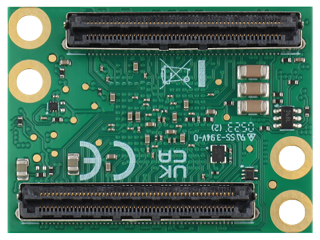

Hardware
========

Overview
--------

.. figure:: _static/TDC-module_top.png

    Top-view of a TimeTagger Module.

    Bottom-view of a TimeTagger Module. For the pin assignment, see
    :numref:`Section %s<pin assignment>`.

.. _pin assignment:

Pin Assignment
--------------
TBA

Inputs and Outputs
------------------

.. figure:: _static/diagram.*

    Block diagram giving an overview of the inputs and outputs of the
    TimeTagger Module.

PCIe Example Setup
------------------

.. figure:: _static/module_on_PCIe_board.png

    Example setup of a TimeTagger Module on a PCIe board.

