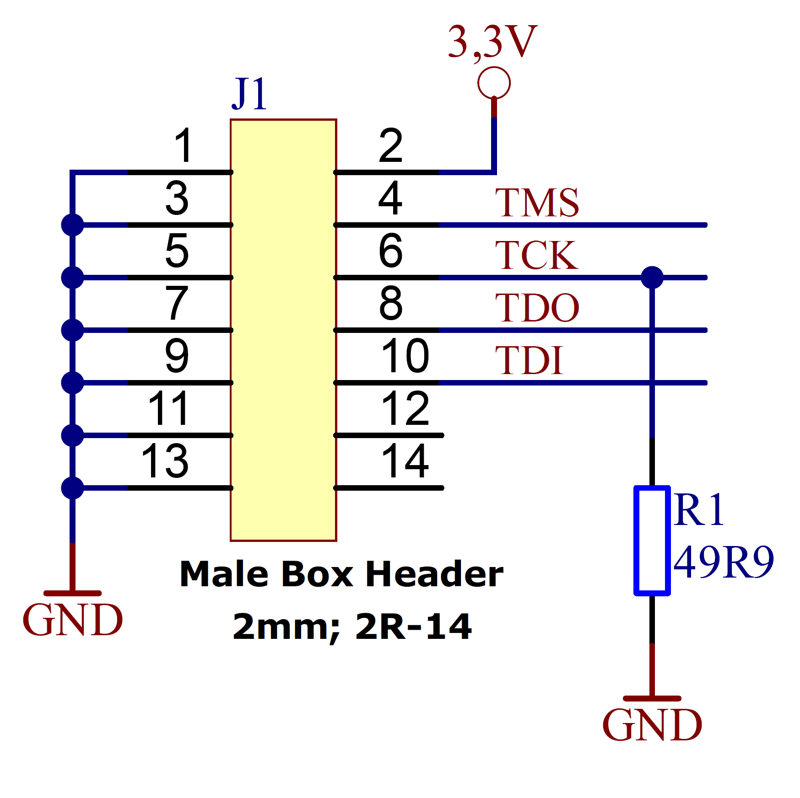

.. role:: raw-html(raw)
    :format: html

.. role:: raw-latex(raw)
    :format: latex

Hardware
========

Overview
--------

.. _fig top:

.. figure:: _static/TDC-module_top.png
    :alt: TimeTagger Module Top
    :width: 40%

    Top-view of a TimeTagger Module.

.. _fig bottom:

.. _fig underneath:

    Bottom-view of a TimeTagger Module. For the pin assignment of connectors
    JB1 and JB2, see :numref:`Section %s<pin assignment>`.

:numref:`Figures %s<fig top>` and :numref:`%s<fig bottom>` show the top and
bottom view of the module.

The TimeTagger Module is connected to a carrier board using two 
B2B connectors Samtec Razor Beam\ :sup:`TM` LSHM-150 (JB1, JB2).
:numref:`Figure %s<fig connector placement>` shows the dimensions of the
board as well as the positioning of the two B2B connectors.

.. _fig connector placement:

.. figure:: _static/TDC-Modul_connector-placement.png
    :alt: TimeTagger Module Dimensions
    :width: 50%

    Dimensions of the module and placement of the B2B connectors and mounting
    holes. All dimensions are in mm. Mating height with a standard connector
    is 8 mm.

:numref:`Figure %s<fig example>` shows the principle of how the TimeTagger
Module may be implemented on a PCIe carrier board.
Note that it only gives an overview of a possible setup. Details for the
implementation are given in the sections below.

- The PCIe 12 V supply a PSU with regulated 3.3 and 2.5 V outputs supplying
  the TimeTagger Module with power.
- The TimeTagger Module communicates with the computer via PCIe.
- A 150 MHz oscillator is connected to the module.
- The COAX start and stop signals are discriminated and connected to the
  module.

.. _fig example:

.. figure:: _static/module_on_PCIe_board.png
    :alt: PCIe Board Setup
    :width: 80%

    Example setup of a TimeTagger Module on a PCIe board.

.. _sec io:

Inputs and Outputs
------------------

:numref:`Figure %s<fig io diagram>` gives an overview of the required and
optional input and output signals of the TimeTagger Module. The required
standards are listed in :numref:`Section %s<sec signal standard>`.

.. _fig io diagram:

.. figure:: _static/diagram.*
    :alt: Block Diagram
    :width: 50%

    Block diagram giving an overview of the inputs and outputs of the
    TimeTagger Module, respectively.

Supply Voltages
^^^^^^^^^^^^^^^

VCC33 and VCC25
***************

.. raw:: html

    

Supply voltages of 3.3 V and 2.5 V.

.. raw:: html

    

Clocking
^^^^^^^^

PCIe_100M_CLK
**************

.. raw:: html

    

A differential 100 MHz clock that complies with PCIe clock specifications
with regards to signaling levels and jitter.

This must be synchronous to the clock of the PCIe host connected to the
module. It can be taken directly from the clock of a PCIe_CEM connector.

100 nF decoupling capacitors should be placed in series of this signal to
implement AC coupling.

.. raw:: html

    

TDC_150M_CLK
************

.. raw:: html

    

A differential LVDS clock signal with 150 MHz freqeuency. This can be
either synchronous or asynchronous to PCIe_100M_CLK.

The quality of this clock effects the measurement accuracy of the TDC, so
a low-jitter clock source must be used. Spread-spectrum clocking should be
disabled for this signal.

.. raw:: html

    

Main Signals
^^^^^^^^^^^^
All these signals must be correctly connected to operate the TimeTagger
Module.

PROG_b
******

.. raw:: html

    

3.3 V CMOS input.

Strobe LOW to initiate a reload of the FPGA firmware.

In a PCIe-CEM system this should be connected to the PERST_b pin of the
connector and provided with a 5 kΩ pull-up to 3.3 V.
When connected to 3.3 V, the firmware is only loaded once at power-up.

.. raw:: html

    

PERST_b
*******

.. raw:: html

    

3.3 V CMOS input.

Reset the PCIe core of the FPGA.

In a PCIe_CEM system, this should be connected to the corresponding signal
from the edge connector. In an embedded system the requirements can vary,
but it could be controlled by a microcontroller output.

Timing should comply to the PCIe_CEM specification. 

.. raw:: html

    

PCIe_TX[3:0]
************

.. raw:: html

    

Differential PCIe output signals to transmit packets from the
TimeTagger Module to the host. Compliant to PCIe standards.
The _P and _N signals of each pair can be flipped to simplify routing.

The PCIe protocol will detect and correct the inversion.

Lanes 0 to 3, or lanes 0 and 1, or only lane 0 can be connected to the
host. The ordering of lanes can be reversed to simplify routing. 

.. raw:: html

    

PCIe_RX[3:0]
************

.. raw:: html

    

Same as PCIe_TX but an input for receiving packets from the host at the
module.
100 nF decoupling capacitors must be placed in series to these signals.

.. raw:: html

    

START
*****

.. raw:: html

    

Differential LVDS input to start a TDC measurement. If single ended
signals or small scale signals shall be processed, a discriminator must be
implemented.

This signal must not be left floating and should always be in a well
defined LOW or HIGH state.

.. raw:: html

    

STOP[3:0]
*********

.. raw:: html

    

Differential LVDS input to create a time measurement on the respective
channel.

This signal must not be left floating and should always be in a well
defined LOW or HIGH state.

.. raw:: html

    

Optional Signals
^^^^^^^^^^^^^^^^
These signals are not necessary for operating the module, but they can provide
useful additional features.

.. attention::

    Even if not in use, JTAG_TCK and TEMP_ALARM_b have to be connected
    correctly. See the descriptions of these signals for details.

PCIe_SMCLK and PCIe_SMDAT
*************************

.. raw:: html

    

3.3 V CMOS signals for system management bus.

Currently not supported by the driver and firmware.

Can be connected to the corresponding signals on a PCIe_CEM connector
with the 470 Ω series resistor or can be left floating.

.. raw:: html

    

JTAG signals
************

.. raw:: html

    

The JTAG port for debugging, reflashing and interactive development of
the FPGA hardware. This usually is not required for a production system,
as the firmware delivered with the module provides the capability to
update the firmware over PCIe.

However, we recommend to implement a JTAG connector anyway if space is
available, to simplify debugging of the base board. See 
:numref:`Figure %s<fig jtag circuit diagram>` for the implementation.

There are various JTAG cables for FPGA development available.
The following circuit is compatible to the JTAG-HS2 Programming Cable
by Digilent, provided, e.g., by
`trenz electronic <https://shop.trenz-electronic.de/de/24624-JTAG-HS2-Programmierkabel>`_.

.. _fig jtag circuit diagram:

    Circuit diagram for a JTAG connector.

**JTAG_TDI**
    3.3 V CMOS input.

    Data from the JTAG controller to the FPGA.

**JTAG_TDO**
    3.3 V CMOS output.

    Data from the FPGA to the JTAG controller. 

**JTAG_TMS**
    3.3 V CMOS input.

    Control signal from the JTAG controller to the FPGA.

**JTAG_TCK**
    3.3 V CMOS intput.

    Clock signal from the JTAG controller to the FPGA. 

    If JTAG is used, a 50 Ω termination close to the FPGA module is
    required.

    Otherwise, if JTAG is not used, this signal must be tied to GND
    or 3.3 V.

.. raw:: html

    

Status Signals
**************

.. raw:: html

    

There are four signals provided that can be used to provide information
about the module status.

In the original TimeTagger4 base boards, these signals are connected to
LEDs to provide visual feedback to the user. In an embedded system they
could alternatively be connected to microcontroller inputs.

**DONE**
    3.3 V CMOS output.

    A high value indicates that the FPGA completed configuration.
    cronologic usually connects this to a red LED over a 220 Ω series
    resistor.

    The LED is lighting up during configuration so that a failed
    configuration is immediately visible.

**STAT_INITIALIZED**
    3.3 V CMOS output.

    Is set to HIGH after the board is initialized by the driver.

    Is reset to LOW when the device is closed by the software.

**STAT_CAPTURE[1:0]**
    3.3 V CMOS output.

    Provide status information. These can be connected to 3.3 V via
    120 Ω series resistor and an LED.  

    STAT_CAPTURE[0] is set HIGH when the driver is in the capturing state.

    Then, STAT_CAPTURE[1] becomes HIGH when a first start pulse is
    detected during capturing.

    These bits are sticky and stay HIGH until capturing is stopped,
    with one exception: If missing groups are detected, STAT_CAPTURE[0]
    becomes LOW and STAT_CAPTURE[1] becomes HIGH.

    These pins can be connected to a dual-color LED that lights up, e.g.,
    green when capture is started, yellow when start signals are detected,
    and red when groups are missing. For this STAT_CAPTURE[0] should
    light up the green LED and STAT_CAPTURE[1] should light up the
    red LED.

.. raw:: html

    

TiGer Signals
*************

.. raw:: html

    

**TiGer[4:0]**
    3.3 V CMOS output.

    These pins are controlled by the TiGer timing generator. They can be
    used to control the timing of the system with high precision. 

**TiGer_OE[4:0]**
    3.3 V CMOS output. Output Enable for the TiGer.

    On cronologic's TimeTagger4 boards, the connectors for the TiGer
    outputs are shared with the TDC inputs.

    To facilitate this, tristate buffers close to the connector are used to
    conditionally drive the TiGer signals to the connector.

    The buffers are enabled when TiGer_OE is HIGH. In an embedded system
    the TiGer signals usually can be routed directly to their sinks and
    the output enables can be left unconnected.

.. raw:: html

    

DAC Control
***********

.. raw:: html

    

The driver for the module supports controlling of two
`DAC8565 <https://www.ti.com/product/DAC8565>`_
digital-to-analog converters to configure the input thresholds of the
discriminators and the oscillator control voltage.

In an embedded system, the same setup can be used. Alternatively, the
voltages can be controlled by a microcontroller or set to fixed voltages.

DAC1 has OSC_VC on VOUTA and the discriminator threshold of the START
input on VOUTD.

DAC2 has the discriminator thresholds of the for stop channels on its
VOUTx outputs.

DAC3 is not supported yet. The enable is provided to allow future
versions with more channels. 

It is possible to change the meaning of the voltages. For example,
VOUTD of DAC1 can be used as a common threshold for all inputs.
But the driver will not know that and this voltage will be accessed by
the user as the START channel threshold.

**DAC_SYNC**
    3.3 V CMOS output.

    Connect to the SYNC_b pins of the DACs. Avoid stubs.

**DAC_SCLK**
    3.3 V CMOS output.

    Connect to the SCLK pins of the DACs. Avoid stubs.

**DAC_D**
    3.3 V CMOS output.

    Connect to the DIN pins of the DACs. Avoid stubs.

**DAC_RST_b**
    3.3 V CMOS output.

    Connect to the RST_b pins of the DACs. Avoid stubs.

**DAC_EN**
    3.3 V CMOS output.

    Connect to the ENABLE_b pin of the DAC with the same index.

.. raw:: html

    

BOARD[3:0]
**********

.. raw:: html

    

3.3 V CMOS output.

A bit pattern of 4 bits that is made visible in the driver API.

Can be used to communicate version or type information about the base
board to the software, in case it has to act differently for certain
variants.

.. raw:: html

    

TEMP_ALARM_b
************

.. raw:: html

    

3.3 V CMOS input.

When set to LOW, the driver will report a temperature alarm. Can be
connected to the alarm output of a temperature sensor, to a
microcontroller, or can be connected to 3.3 V.

.. raw:: html

    

POWON
*****

.. raw:: html

    

3.3 V CMOS output.

This signal is set to HIGH after all power supplies of the module are
stable and the FPGA on the module is configured.

It can be used to enble power supply circuits that are not required to
supply the TDC module.

.. raw:: html

    

Routing of Differential Signals
-------------------------------

All differential signals on the board are high speed signals that must be
routed carefully to provide good signal integrity.

The routing can either be done as a coupled pair with 100 Ω differential
impedance or as two independent wires with 50 Ω single ended impedance.

An uninterupted reference plane should be on the next layer along the whole
stretch of the connection. Stubs and branches must be avoided.

All differential inputs are terminated on the board with 100 Ω differential
termination. 

.. _sec signal standard:

Signal Standards
----------------

The superscript next to the signal names of the tables in
:numref:`Sections %s<jb1 table>` and :numref:`%s<jb2 table>` refer to the
signal standard, as listed below.

:sup:`1`\ PCIe
    Differential signals with an impedance of 100 Ω compliant with the
    PCIe_CEM standard.

:sup:`2`\ LVCMOS33
    For input signals, V\ :sub:`IL` and V\ :sub:`IH` specify the 
    input voltage for LOW and HIGH, respectively.

    For output signals, V\ :sub:`OL` and V\ :sub:`OH` specify the output
    voltage of LOW and HIGH, respectively.

.. raw:: html

    

    
.. .. table::
..     :width: 100%

..     +------------------+------------------+------------------+------------------+------------------+------------------+------------------+-----------------+
..     | V\ :sub:`IL,min` | V\ :sub:`IL,max` | V\ :sub:`IH,max` | V\ :sub:`IH,max` | V\ :sub:`OL,max` | V\ :sub:`OH,min` | I\ :sub:`OL,max` | I\ :sub:`OH,min`|
..     +==================+==================+==================+==================+==================+==================+==================+=================+
..     | −0.3 V           | 0.8 V            | 2.0 V            | 3.45 V           | 0.4 V            | 2.9 V            | 11 mA            | −11 mA          |
..     +------------------+------------------+------------------+------------------+------------------+------------------+------------------+-----------------+

.. raw:: html

    

:sup:`3`\ LVDS
    In the table below, V\ :sub:`IDIFF` is the differential input voltage
    (U − Ū), where U is HIGH [or (Ū − U), where Ū is HIGH].
    V\ :sub:`ICM` is the input common-mode voltage.
    The input impedance is 100 Ω differential.

.. raw:: html

    

.. .. table::
..     :width: 100%

..     +-----------------+-----+---------+-----+------+
..     | Symbol          | Min | Typical | Max | Unit |
..     +=================+=====+=========+=====+======+
..     | V\ :sub:`IDIFF` | 100 | 350     | 600 | mV   |
..     +-----------------+-----+---------+-----+------+ 
..     | V\ :sub:`ICM`   | 0.3 | 1.2     | 1.5 | V    |
..     +-----------------+-----+---------+-----+------+

.. raw:: html

    

:sup:`4`\ VCC33
    min. 3.2 V; max 3.4 V

:sup:`5`\ VCC25
    min. 2.4 V; max 2.6 V

.. _pin assignment:

Pin Assignment
--------------

The tables in :numref:`Sections %s<jb1 table>` and :numref:`%s<jb2 table>` list
the pin assignments of connectors JB1 and JB2 (see
:numref:`Figure %s<fig underneath>`).

Some signals are optional and do not have to 
be connected, as is described in :numref:`Section %s<sec io>`.

Pins that must not be connected are marked as NC .

.. _jb1 table:

Connector JB1
^^^^^^^^^^^^^

Pin assignment of the JB1 connector. The superscripts refer to the signal
standard (see :numref:`Section %s<sec signal standard>`)

.. raw:: latex

    \begingroup
    \small

.. tabularcolumns:: |R|L|L|L|C|R|L|L|L|

.. table::
    :width: 100%

    +------------------------------------------------------------------+-----+-----+-----------------------------------------------------------++---------------------------------------------------+-----+-----+-------------------------------------------------------------+
    | Name                                                             | Pin | Pin | Name                                                      || Name                                              | Pin | Pin |  Name                                                       |
    +==================================================================+=====+=====+===========================================================++===================================================+=====+=====+=============================================================+
    | :ref:`PCIe_RX3_P <hardware:PCIe_RX[3:0]>`\ :sup:`1`              |  1  |  2  | :ref:`PCIe_100M_CLK_P <hardware:PCIe_100M_CLK>`\ :sup:`1` ||       NC                                          | 51  | 52  | NC                                                          |
    +------------------------------------------------------------------+-----+-----+-----------------------------------------------------------++---------------------------------------------------+-----+-----+-------------------------------------------------------------+
    | :ref:`PCIe_RX3_N <hardware:PCIe_RX[3:0]>`\ :sup:`1`              |  3  |  4  | :ref:`PCIe_100M_CLK_N <hardware:PCIe_100M_CLK>`\ :sup:`1` ||     NC                                            | 53  | 54  | :ref:`DAC_EN2 <hardware:DAC Control>`\ :sup:`2`             |
    +------------------------------------------------------------------+-----+-----+-----------------------------------------------------------++---------------------------------------------------+-----+-----+-------------------------------------------------------------+
    |  GND                                                             |  5  |  6  | GND                                                       ||   NC                                              | 55  | 56  | :ref:`DAC_RST <hardware:DAC Control>`\ :sup:`2`             |
    +------------------------------------------------------------------+-----+-----+-----------------------------------------------------------++---------------------------------------------------+-----+-----+-------------------------------------------------------------+
    | :ref:`PCIe_RX2_P <hardware:PCIe_RX[3:0]>`\ :sup:`1`              |  7  |  8  | :ref:`PCIe_TX3_P <hardware:PCIe_TX[3:0]>`\ :sup:`1`       ||  NC                                               | 57  | 58  | :ref:`DAC_D <hardware:DAC Control>`\ :sup:`2`               |
    +------------------------------------------------------------------+-----+-----+-----------------------------------------------------------++---------------------------------------------------+-----+-----+-------------------------------------------------------------+
    | :ref:`PCIe_RX2_N <hardware:PCIe_RX[3:0]>`\ :sup:`1`              |  9  | 10  | :ref:`PCIe_TX3_N <hardware:PCIe_TX[3:0]>`\ :sup:`1`       || NC                                                | 59  | 60  | :ref:`DAC_SCLK <hardware:DAC Control>`\ :sup:`2`            |
    +------------------------------------------------------------------+-----+-----+-----------------------------------------------------------++---------------------------------------------------+-----+-----+-------------------------------------------------------------+
    |  GND                                                             | 11  | 12  | GND                                                       || :ref:`VCC33 <hardware:VCC33 and VCC25>`\ :sup:`4` | 61  | 62  | :ref:`DAC_EN1 <hardware:DAC Control>`\ :sup:`2`             |
    +------------------------------------------------------------------+-----+-----+-----------------------------------------------------------++---------------------------------------------------+-----+-----+-------------------------------------------------------------+
    | :ref:`PCIe_RX1_P <hardware:PCIe_RX[3:0]>`\ :sup:`1`              | 13  | 14  | :ref:`PCIe_TX2_P <hardware:PCIe_TX[3:0]>`\ :sup:`1`       || :ref:`BOARD0 <hardware:BOARD[3:0]>`\ :sup:`2`     | 63  | 64  | :ref:`DAC_SYNC <hardware:DAC Control>`\ :sup:`2`            |
    +------------------------------------------------------------------+-----+-----+-----------------------------------------------------------++---------------------------------------------------+-----+-----+-------------------------------------------------------------+
    | :ref:`PCIe_RX1_N <hardware:PCIe_RX[3:0]>`\ :sup:`1`              | 15  | 16  | :ref:`PCIe_TX2_N <hardware:PCIe_TX[3:0]>`\ :sup:`1`       || :ref:`BOARD1 <hardware:BOARD[3:0]>`\ :sup:`2`     | 65  | 66  | GND                                                         |
    +------------------------------------------------------------------+-----+-----+-----------------------------------------------------------++---------------------------------------------------+-----+-----+-------------------------------------------------------------+
    |  GND                                                             | 17  | 18  | GND                                                       || :ref:`BOARD2 <hardware:BOARD[3:0]>`\ :sup:`2`     | 67  | 68  | NC                                                          |
    +------------------------------------------------------------------+-----+-----+-----------------------------------------------------------++---------------------------------------------------+-----+-----+-------------------------------------------------------------+
    | :ref:`PCIe_RX0_P <hardware:PCIe_RX[3:0]>`\ :sup:`1`              | 19  | 20  | :ref:`PCIe_TX1_P <hardware:PCIe_TX[3:0]>`\ :sup:`1`       || :ref:`BOARD3 <hardware:BOARD[3:0]>`\ :sup:`2`     | 69  | 70  | NC                                                          |
    +------------------------------------------------------------------+-----+-----+-----------------------------------------------------------++---------------------------------------------------+-----+-----+-------------------------------------------------------------+
    | :ref:`PCIe_RX0_N <hardware:PCIe_RX[3:0]>`\ :sup:`1`              | 21  | 22  | :ref:`PCIe_TX1_N <hardware:PCIe_TX[3:0]>`\ :sup:`1`       || NC                                                | 71  | 72  | NC                                                          |
    +------------------------------------------------------------------+-----+-----+-----------------------------------------------------------++---------------------------------------------------+-----+-----+-------------------------------------------------------------+
    |  GND                                                             | 23  | 24  | GND                                                       || NC                                                | 73  | 74  | NC                                                          |
    +------------------------------------------------------------------+-----+-----+-----------------------------------------------------------++---------------------------------------------------+-----+-----+-------------------------------------------------------------+
    | NC                                                               | 25  | 26  | :ref:`PCIe_TX0_P <hardware:PCIe_TX[3:0]>`\ :sup:`1`       || NC                                                | 75  | 76  | NC                                                          |
    +------------------------------------------------------------------+-----+-----+-----------------------------------------------------------++---------------------------------------------------+-----+-----+-------------------------------------------------------------+
    | GND                                                              | 27  | 28  | :ref:`PCIe_TX0_N <hardware:PCIe_TX[3:0]>`\ :sup:`1`       || NC                                                | 77  | 78  | NC                                                          |
    +------------------------------------------------------------------+-----+-----+-----------------------------------------------------------++---------------------------------------------------+-----+-----+-------------------------------------------------------------+
    | GND                                                              | 29  | 30  | GND                                                       || NC                                                | 79  | 80  | NC                                                          |
    +------------------------------------------------------------------+-----+-----+-----------------------------------------------------------++---------------------------------------------------+-----+-----+-------------------------------------------------------------+
    | :ref:`PCIe_SMCLK <hardware:PCIe_SMCLK and PCIe_SMDAT>`\ :sup:`2` | 31  | 32  | :ref:`TiGer2_OE <hardware:TiGer Signals>`\ :sup:`2`       || NC                                                | 81  | 82  | :ref:`STAT_INITIALIZED <hardware:Status Signals>`\ :sup:`2` |
    +------------------------------------------------------------------+-----+-----+-----------------------------------------------------------++---------------------------------------------------+-----+-----+-------------------------------------------------------------+
    | :ref:`PCIe_SMDAT <hardware:PCIe_SMCLK and PCIe_SMDAT>`\ :sup:`2` | 33  | 34  | :ref:`TiGer3 <hardware:TiGer Signals>`\ :sup:`2`          || 3.3 V Testpin                                     | 83  | 84  | GND                                                         |
    +------------------------------------------------------------------+-----+-----+-----------------------------------------------------------++---------------------------------------------------+-----+-----+-------------------------------------------------------------+
    | NC                                                               | 35  | 36  | :ref:`TiGer2 <hardware:TiGer Signals>`\ :sup:`2`          || NC                                                | 85  | 86  | :ref:`JTAG_TDI <hardware:JTAG Signals>`\ :sup:`2`           |
    +------------------------------------------------------------------+-----+-----+-----------------------------------------------------------++---------------------------------------------------+-----+-----+-------------------------------------------------------------+
    | NC                                                               | 37  | 38  | :ref:`TiGer3_OE <hardware:TiGer Signals>`\ :sup:`2`       || NC                                                | 87  | 88  | :ref:`JTAG_TDO <hardware:JTAG Signals>`\ :sup:`2`           |
    +------------------------------------------------------------------+-----+-----+-----------------------------------------------------------++---------------------------------------------------+-----+-----+-------------------------------------------------------------+
    | :ref:`TiGer1_OE <hardware:TiGer Signals>`\ :sup:`2`              | 39  | 40  | :ref:`TiGer4 <hardware:TiGer Signals>`\ :sup:`2`          || NC                                                | 89  | 90  | :ref:`JTAG_TCK <hardware:JTAG Signals>`\ :sup:`2`           |
    +------------------------------------------------------------------+-----+-----+-----------------------------------------------------------++---------------------------------------------------+-----+-----+-------------------------------------------------------------+
    | :ref:`TiGer0_OE <hardware:TiGer Signals>`\ :sup:`2`              | 41  | 42  | :ref:`TiGer4_OE <hardware:TiGer Signals>`\ :sup:`2`       || NC                                                | 91  | 92  | :ref:`JTAG_TMS <hardware:JTAG Signals>`\ :sup:`2`           |
    +------------------------------------------------------------------+-----+-----+-----------------------------------------------------------++---------------------------------------------------+-----+-----+-------------------------------------------------------------+
    | :ref:`TiGer1 <hardware:TiGer Signals>`\ :sup:`2`                 | 43  | 44  |  NC                                                       || NC                                                | 93  | 94  |  :ref:`PROG_b <hardware:PROG_b>`\ :sup:`2`                  |
    +------------------------------------------------------------------+-----+-----+-----------------------------------------------------------++---------------------------------------------------+-----+-----+-------------------------------------------------------------+
    | :ref:`TiGer0 <hardware:TiGer Signals>`\ :sup:`2`                 | 45  | 46  |NC                                                         || NC                                                | 95  | 96  |  :ref:`DONE <hardware:Status Signals>`\ :sup:`2`            |
    +------------------------------------------------------------------+-----+-----+-----------------------------------------------------------++---------------------------------------------------+-----+-----+-------------------------------------------------------------+
    | GND                                                              | 47  | 48  |  GND                                                      || :ref:`VCC33 <hardware:VCC33 and VCC25>`\ :sup:`4` | 97  | 98  |   GND                                                       |
    +------------------------------------------------------------------+-----+-----+-----------------------------------------------------------++---------------------------------------------------+-----+-----+-------------------------------------------------------------+
    | :ref:`PERST_b <hardware:PERST_b>`\ :sup:`2`                      | 49  | 50  | NC                                                        || :ref:`VCC33 <hardware:VCC33 and VCC25>`\ :sup:`4` | 99  | 100 |  GND                                                        |
    +------------------------------------------------------------------+-----+-----+-----------------------------------------------------------++---------------------------------------------------+-----+-----+-------------------------------------------------------------+
    |                                                                  |     |     |                                                           ||  GND                                              | F1  | F2  |   GND                                                       |
    +------------------------------------------------------------------+-----+-----+-----------------------------------------------------------++---------------------------------------------------+-----+-----+-------------------------------------------------------------+

.. raw:: latex

    \endgroup

.. _jb2 table:

Connector JB2
^^^^^^^^^^^^^

Pin assignment of the JB1 connector. The superscripts refer to the signal
standard (see :numref:`Section %s<sec signal standard>`)

.. raw:: latex

    \begingroup
    \small

.. tabularcolumns:: |R|L|L|L|C|R|L|L|L|

.. table::
    :width: 100%

    +-----------------------------------------------+-----+-----+---------------------------------------------------------++----------------------------------------------------------+-----+-----+-------------------------------------------------------+
    | Name                                          | Pin | Pin | Name                                                    || Name                                                     | Pin | Pin | Name                                                  |
    +===============================================+=====+=====+=========================================================++==========================================================+=====+=====+=======================================================+
    | NC                                            |  1  |  2  | NC                                                      || :ref:`START_N <hardware:START>`\ :sup:`3`                | 51  | 52  | NC                                                    |
    +-----------------------------------------------+-----+-----+---------------------------------------------------------++----------------------------------------------------------+-----+-----+-------------------------------------------------------+
    | NC                                            |  3  |  4  | NC                                                      || NC                                                       | 53  | 54  | :ref:`VCC25 <hardware:VCC33 and VCC25>`\ :sup:`5`     |
    +-----------------------------------------------+-----+-----+---------------------------------------------------------++----------------------------------------------------------+-----+-----+-------------------------------------------------------+
    | NC                                            |  5  |  6  | NC                                                      || NC                                                       | 55  | 56  | :ref:`POWON <hardware:POWON>`\ :sup:`2`               |
    +-----------------------------------------------+-----+-----+---------------------------------------------------------++----------------------------------------------------------+-----+-----+-------------------------------------------------------+
    | NC                                            |  7  |  8  | NC                                                      || :ref:`STAT_CAPTURE0 <hardware:Status Signals>`\ :sup:`2` | 57  | 58  | :ref:`TEMP_ALARM_b <hardware:TEMP_ALARM_b>`\ :sup:`2` |
    +-----------------------------------------------+-----+-----+---------------------------------------------------------++----------------------------------------------------------+-----+-----+-------------------------------------------------------+
    | NC                                            |  9  | 10  | :ref:`STOP3_N <hardware:STOP[3:0]>`\ :sup:`3`           || :ref:`STAT_CAPTURE1 <hardware:Status Signals>`\ :sup:`2` | 59  | 60  | NC                                                    |
    +-----------------------------------------------+-----+-----+---------------------------------------------------------++----------------------------------------------------------+-----+-----+-------------------------------------------------------+
    | NC                                            | 11  | 12  | :ref:`STOP3_P <hardware:STOP[3:0]>`\ :sup:`3`           || NC                                                       | 61  | 62  | NC                                                    |
    +-----------------------------------------------+-----+-----+---------------------------------------------------------++----------------------------------------------------------+-----+-----+-------------------------------------------------------+
    | NC                                            | 13  | 14  | :ref:`STOP2_N <hardware:STOP[3:0]>`\ :sup:`3`           || GND                                                      | 63  | 64  | NC                                                    |
    +-----------------------------------------------+-----+-----+---------------------------------------------------------++----------------------------------------------------------+-----+-----+-------------------------------------------------------+
    | NC                                            | 15  | 16  | :ref:`STOP2_P <hardware:STOP[3:0]>`\ :sup:`3`           || NC                                                       | 65  | 66  | NC                                                    |
    +-----------------------------------------------+-----+-----+---------------------------------------------------------++----------------------------------------------------------+-----+-----+-------------------------------------------------------+
    | GND                                           | 17  | 18  | NC                                                      || NC                                                       | 67  | 68  | NC                                                    |
    +-----------------------------------------------+-----+-----+---------------------------------------------------------++----------------------------------------------------------+-----+-----+-------------------------------------------------------+
    | NC                                            | 19  | 20  | NC                                                      || NC                                                       | 69  | 70  |NC                                                     |
    +-----------------------------------------------+-----+-----+---------------------------------------------------------++----------------------------------------------------------+-----+-----+-------------------------------------------------------+
    | NC                                            | 21  | 22  | NC                                                      || NC                                                       | 71  | 72  | GND                                                   |
    +-----------------------------------------------+-----+-----+---------------------------------------------------------++----------------------------------------------------------+-----+-----+-------------------------------------------------------+
    | NC                                            | 23  | 24  | NC                                                      || NC                                                       | 73  | 74  | NC                                                    |
    +-----------------------------------------------+-----+-----+---------------------------------------------------------++----------------------------------------------------------+-----+-----+-------------------------------------------------------+
    | NC                                            | 25  | 26  | NC                                                      || NC                                                       | 75  | 76  | NC                                                    |
    +-----------------------------------------------+-----+-----+---------------------------------------------------------++----------------------------------------------------------+-----+-----+-------------------------------------------------------+
    | NC                                            | 27  | 28  | NC                                                      || NC                                                       | 77  | 78  | NC                                                    |
    +-----------------------------------------------+-----+-----+---------------------------------------------------------++----------------------------------------------------------+-----+-----+-------------------------------------------------------+
    | NC                                            | 29  | 30  | NC                                                      || NC                                                       | 79  | 80  | NC                                                    |
    +-----------------------------------------------+-----+-----+---------------------------------------------------------++----------------------------------------------------------+-----+-----+-------------------------------------------------------+
    | NC                                            | 31  | 32  | :ref:`TDC_150M_CLK_P <hardware:TDC_150M_CLK>`\ :sup:`3` || NC                                                       | 81  | 82  | NC                                                    |
    +-----------------------------------------------+-----+-----+---------------------------------------------------------++----------------------------------------------------------+-----+-----+-------------------------------------------------------+
    | NC                                            | 33  | 34  | :ref:`TDC_150M_CLK_N <hardware:TDC_150M_CLK>`\ :sup:`3` || GND                                                      | 83  | 84  | NC                                                    |
    +-----------------------------------------------+-----+-----+---------------------------------------------------------++----------------------------------------------------------+-----+-----+-------------------------------------------------------+
    | GND                                           | 35  | 36  |  GND                                                    || NC                                                       | 85  | 86  | NC                                                    |
    +-----------------------------------------------+-----+-----+---------------------------------------------------------++----------------------------------------------------------+-----+-----+-------------------------------------------------------+
    | NC                                            | 37  | 38  |  NC                                                     || NC                                                       | 87  | 88  | NC                                                    |
    +-----------------------------------------------+-----+-----+---------------------------------------------------------++----------------------------------------------------------+-----+-----+-------------------------------------------------------+
    | NC                                            | 39  | 40  |  NC                                                     || NC                                                       | 89  | 90  | GND                                                   |
    +-----------------------------------------------+-----+-----+---------------------------------------------------------++----------------------------------------------------------+-----+-----+-------------------------------------------------------+
    | :ref:`STOP1_N <hardware:STOP[3:0]>`\ :sup:`3` | 41  | 42  |  NC                                                     || NC                                                       | 91  | 92  | NC                                                    |
    +-----------------------------------------------+-----+-----+---------------------------------------------------------++----------------------------------------------------------+-----+-----+-------------------------------------------------------+
    | :ref:`STOP1_P <hardware:STOP[3:0]>`\ :sup:`3` | 43  | 44  |  NC                                                     || NC                                                       | 93  | 94  | NC                                                    |
    +-----------------------------------------------+-----+-----+---------------------------------------------------------++----------------------------------------------------------+-----+-----+-------------------------------------------------------+
    | :ref:`STOP0_N <hardware:STOP[3:0]>`\ :sup:`3` | 45  | 46  |  NC                                                     || NC                                                       | 95  | 96  | NC                                                    |
    +-----------------------------------------------+-----+-----+---------------------------------------------------------++----------------------------------------------------------+-----+-----+-------------------------------------------------------+
    | :ref:`STOP0_P <hardware:STOP[3:0]>`\ :sup:`3` | 47  | 48  |  NC                                                     || NC                                                       | 97  | 98  | NC                                                    |
    +-----------------------------------------------+-----+-----+---------------------------------------------------------++----------------------------------------------------------+-----+-----+-------------------------------------------------------+
    | :ref:`START_P <hardware:START>`\ :sup:`3`     | 49  | 50  |  NC                                                     || NC                                                       | 99  | 100 |NC                                                     |
    +-----------------------------------------------+-----+-----+---------------------------------------------------------++----------------------------------------------------------+-----+-----+-------------------------------------------------------+
    |                                               |     |     |                                                         ||  GND                                                     | F1  | F2  |   GND                                                 |
    +-----------------------------------------------+-----+-----+---------------------------------------------------------++----------------------------------------------------------+-----+-----+-------------------------------------------------------+

.. raw:: latex

    \endgroup
