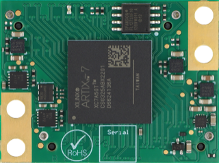

Hardware
========

Overview
--------

    Top-view of a TimeTagger Module.

.. _fig underneath:
.. figure:: _static/TDC-Module_underneath.png
    :alt: TimeTagger Module Bottom

    Bottom-view of a TimeTagger Module. For the pin assignment, see
    :numref:`Section %s<pin assignment>`.

.. _sec io:

Inputs and Outputs
------------------

.. figure:: _static/diagram.*
    :alt: Block Diagram

    Block diagram giving an overview of the inputs and outputs of the
    TimeTagger Module.

.. _sec signal standard:

Signal Standards
----------------

The superscript next to the signal names of the tables in
:numref:`Sections %s<jb1 table>` and :numref:`%s<jb2 table>` refer to the
signal standard, as listed below.

:sup:`1`\ PCIe
    Signals correspond to the PCIe specifications.

:sup:`2`\ LVCMOS33
    TBA

:sup:`3`\ LVDS
    TBA

:sup:`4`\ VCC33
    min. 3.2 V; max 3.4 V

:sup:`5`\ VCC25
    min. 2.4 V; max 2.5 V

.. _pin assignment:

Pin Assignment
--------------

.. warning::

    This user guide is under development. The Pin-Assignment below is subject
    to change.

The tables in :numref:`Sections %s<jb1 table>` and :numref:`%s<jb2 table>` list
the pin assignments of connectors JB1 and JB2 (see
:numref:`Figure %s<fig underneath>`).

Pins without labels are unused. Some signals are optional and do not have to 
be connected, as is described in :numref:`Section %s<sec io>`.

.. _jb1 table:

Connector JB1
^^^^^^^^^^^^^

Pin assignment of the JB1 connector. The superscripts refer to the signal
standard (see :numref:`Section %s<sec signal standard>`)

.. raw:: latex

    \begingroup
    \small

.. tabularcolumns:: |R|L|L|L|C|R|L|L|L|

.. table::
    :width: 100%

    +----------------------------+-----+-----+------------------------------++-----------------+-----+-----+---------------------+
    | Name                       | Pin | Pin | Name                         || Name            | Pin | Pin |  Name               |
    +============================+=====+=====+==============================++=================+=====+=====+=====================+
    | PCIe_RX3_P\ :sup:`1`       |  1  |  2  | PCIe_100M_CLK_P\ :sup:`1`    ||                 | 51  | 52  |                     |
    +----------------------------+-----+-----+------------------------------++-----------------+-----+-----+---------------------+
    | PCIe_RX3_N\ :sup:`1`       |  3  |  4  | PCIe_100M_CLK_N\ :sup:`1`    ||                 | 53  | 54  | DAC_EN2\ :sup:`2`   |
    +----------------------------+-----+-----+------------------------------++-----------------+-----+-----+---------------------+
    |  GND                       |  5  |  6  | GND                          ||                 | 55  | 56  | DAC_RST\ :sup:`2`   |
    +----------------------------+-----+-----+------------------------------++-----------------+-----+-----+---------------------+
    | PCIe_RX2_P\ :sup:`1`       |  7  |  8  | PCIe_TX3_P\ :sup:`1`         ||                 | 57  | 58  | DAC_DIN\ :sup:`2`   |
    +----------------------------+-----+-----+------------------------------++-----------------+-----+-----+---------------------+
    | PCIe_RX2_N\ :sup:`1`       |  9  | 10  | PCIe_TX3_N\ :sup:`1`         ||                 | 59  | 60  | DAC_SCLK\ :sup:`2`  |
    +----------------------------+-----+-----+------------------------------++-----------------+-----+-----+---------------------+
    |  GND                       | 11  | 12  | GND                          || VCC33\ :sup:`4` | 61  | 62  | DAC_EN1\ :sup:`2`   |
    +----------------------------+-----+-----+------------------------------++-----------------+-----+-----+---------------------+
    | PCIe_RX1_P\ :sup:`1`       | 13  | 14  | PCIe_TX2_P\ :sup:`1`         ||                 | 63  | 64  | DAC_SYNC\ :sup:`2`  |
    +----------------------------+-----+-----+------------------------------++-----------------+-----+-----+---------------------+
    | PCIe_RX1_N\ :sup:`1`       | 15  | 16  | PCIe_TX2_N\ :sup:`1`         ||                 | 65  | 66  | GND                 |
    +----------------------------+-----+-----+------------------------------++-----------------+-----+-----+---------------------+
    |  GND                       | 17  | 18  | GND                          ||                 | 67  | 68  |                     |
    +----------------------------+-----+-----+------------------------------++-----------------+-----+-----+---------------------+
    | PCIe_RX0_P\ :sup:`1`       | 19  | 20  | PCIe_TX1_P\ :sup:`1`         ||                 | 69  | 70  |                     |
    +----------------------------+-----+-----+------------------------------++-----------------+-----+-----+---------------------+
    | PCIe_RX0_N\ :sup:`1`       | 21  | 22  | PCIe_TX1_N\ :sup:`1`         ||                 | 71  | 72  |                     |
    +----------------------------+-----+-----+------------------------------++-----------------+-----+-----+---------------------+
    |  GND                       | 23  | 24  | GND                          ||                 | 73  | 74  |                     |
    +----------------------------+-----+-----+------------------------------++-----------------+-----+-----+---------------------+
    |                            | 25  | 26  | PCIe_TX0_P\ :sup:`1`         ||                 | 75  | 76  |                     |
    +----------------------------+-----+-----+------------------------------++-----------------+-----+-----+---------------------+
    | GND                        | 27  | 28  | PCIe_TX0_N\ :sup:`1`         ||                 | 77  | 78  |                     |
    +----------------------------+-----+-----+------------------------------++-----------------+-----+-----+---------------------+
    | GND                        | 29  | 30  | GND                          ||                 | 79  | 80  |                     |
    +----------------------------+-----+-----+------------------------------++-----------------+-----+-----+---------------------+
    | PCIe_SMCLK\ :sup:`1`       | 31  | 32  | TiGer_STOP1_OE\ :sup:`2`     ||                 | 81  | 82  | LED_STAT\ :sup:`2`  |
    +----------------------------+-----+-----+------------------------------++-----------------+-----+-----+---------------------+
    | PCIe_SMDAT\ :sup:`1`       | 33  | 34  | TiGer_STOP2\ :sup:`2`        || 3.3 V Testpin   | 83  | 84  | GND                 |
    +----------------------------+-----+-----+------------------------------++-----------------+-----+-----+---------------------+
    | FAN_PWM\ :sup:`2`          | 35  | 36  | TiGer_STOP1\ :sup:`2`        ||                 | 85  | 86  | JTAG_TDI\ :sup:`2`  |
    +----------------------------+-----+-----+------------------------------++-----------------+-----+-----+---------------------+
    | FAN_TACHO\ :sup:`2`        | 37  | 38  | TiGer_STOP2_OE\ :sup:`2`     ||                 | 87  | 88  | JTAG_TDO\ :sup:`2`  |
    +----------------------------+-----+-----+------------------------------++-----------------+-----+-----+---------------------+
    | TiGer_STOP0_OE\ :sup:`2`   | 39  | 40  | TiGer_STOP3\ :sup:`2`        ||                 | 89  | 90  | JTAG_TCK\ :sup:`2`  |
    +----------------------------+-----+-----+------------------------------++-----------------+-----+-----+---------------------+
    | TiGer_START_OE\ :sup:`2`   | 41  | 42  | TiGer_STOP3_OE\ :sup:`2`     ||                 | 91  | 92  | JTAG_TMS\ :sup:`2`  |
    +----------------------------+-----+-----+------------------------------++-----------------+-----+-----+---------------------+
    | TiGer_STOP0\ :sup:`2`      | 43  | 44  |                              ||                 | 93  | 94  |  PROG_n\ :sup:`1`   |
    +----------------------------+-----+-----+------------------------------++-----------------+-----+-----+---------------------+
    | TiGer_START\ :sup:`2`      | 45  | 46  |                              || GND             | 95  | 96  |  DONE\ :sup:`2`     |
    +----------------------------+-----+-----+------------------------------++-----------------+-----+-----+---------------------+
    | GND                        | 47  | 48  |  GND                         || VCC33\ :sup:`4` | 97  | 98  |   GND               |
    +----------------------------+-----+-----+------------------------------++-----------------+-----+-----+---------------------+
    | PERST_n\ :sup:`1`          | 49  | 50  |                              || VCC33\ :sup:`4` | 99  | 100 |  GND                |
    +----------------------------+-----+-----+------------------------------++-----------------+-----+-----+---------------------+
    |                            |     |     |                              ||  GND            | F1  | F2  |   GND               |
    +----------------------------+-----+-----+------------------------------++-----------------+-----+-----+---------------------+

.. raw:: latex

    \endgroup

.. _jb2 table:

Connector JB2
^^^^^^^^^^^^^

Pin assignment of the JB1 connector. The superscripts refer to the signal
standard (see :numref:`Section %s<sec signal standard>`)

.. raw:: latex

    \begingroup
    \small

.. tabularcolumns:: |R|L|L|L|C|R|L|L|L|

.. table::
    :width: 100%

    +------------------+-----+-----+--------------------------++-----------------------------+-----+-----+-----------------+
    | Name             | Pin | Pin | Name                     || Name                        | Pin | Pin | Name            |
    +==================+=====+=====+==========================++=============================+=====+=====+=================+
    |                  |  1  |  2  |                          || START_N\ :sup:`3`           | 51  | 52  |                 |
    +------------------+-----+-----+--------------------------++-----------------------------+-----+-----+-----------------+
    |                  |  3  |  4  |                          ||                             | 53  | 54  | VCC25\ :sup:`5` |
    +------------------+-----+-----+--------------------------++-----------------------------+-----+-----+-----------------+
    |                  |  5  |  6  |                          ||                             | 55  | 56  | POWON\ :sup:`2` |
    +------------------+-----+-----+--------------------------++-----------------------------+-----+-----+-----------------+
    |                  |  7  |  8  |                          || LED_GN\ :sup:`2`            | 57  | 58  |                 |
    +------------------+-----+-----+--------------------------++-----------------------------+-----+-----+-----------------+
    |                  |  9  | 10  | STOP3_N\ :sup:`3`        || LED_RED\ :sup:`2`           | 59  | 60  |                 |
    +------------------+-----+-----+--------------------------++-----------------------------+-----+-----+-----------------+
    |                  | 11  | 12  | STOP3_P\ :sup:`3`        ||  CLK_SYNC\ :sup:`2`         | 61  | 62  |                 |
    +------------------+-----+-----+--------------------------++-----------------------------+-----+-----+-----------------+
    |                  | 13  | 14  | STOP2_N\ :sup:`3`        ||  CLK_SPI_MISO\ :sup:`2`     | 63  | 64  |                 |
    +------------------+-----+-----+--------------------------++-----------------------------+-----+-----+-----------------+
    |                  | 15  | 16  | STOP2_P\ :sup:`3`        ||  CLK_SPI_MOSI\ :sup:`2`     | 65  | 66  |                 |
    +------------------+-----+-----+--------------------------++-----------------------------+-----+-----+-----------------+
    | GND              | 17  | 18  |                          ||                             | 67  | 68  |                 |
    +------------------+-----+-----+--------------------------++-----------------------------+-----+-----+-----------------+
    |                  | 19  | 20  |                          ||                             | 69  | 70  |                 |
    +------------------+-----+-----+--------------------------++-----------------------------+-----+-----+-----------------+
    |                  | 21  | 22  |                          ||                             | 71  | 72  |   GND           |
    +------------------+-----+-----+--------------------------++-----------------------------+-----+-----+-----------------+
    |                  | 23  | 24  |                          ||                             | 73  | 74  |                 |
    +------------------+-----+-----+--------------------------++-----------------------------+-----+-----+-----------------+
    |                  | 25  | 26  |                          ||  CLK_SPI_CLK\ :sup:`2`      | 75  | 76  |                 |
    +------------------+-----+-----+--------------------------++-----------------------------+-----+-----+-----------------+
    |                  | 27  | 28  |                          ||  CLK_SPI_LE\ :sup:`2`       | 77  | 78  |                 |
    +------------------+-----+-----+--------------------------++-----------------------------+-----+-----+-----------------+
    |                  | 29  | 30  |                          ||  CLK_REF_SEL\ :sup:`2`      | 79  | 80  |                 |
    +------------------+-----+-----+--------------------------++-----------------------------+-----+-----+-----------------+
    |                  | 31  | 32  | TDC_150M_CLK_P\ :sup:`3` ||  CLK_SPI_PLL_LOCK\ :sup:`2` | 81  | 82  |                 |
    +------------------+-----+-----+--------------------------++-----------------------------+-----+-----+-----------------+
    |                  | 33  | 34  | TDC_150M_CLK_N\ :sup:`3` || GND                         | 83  | 84  |                 |
    +------------------+-----+-----+--------------------------++-----------------------------+-----+-----+-----------------+
    | GND              | 35  | 36  |  GND                     ||                             | 85  | 86  |                 |
    +------------------+-----+-----+--------------------------++-----------------------------+-----+-----+-----------------+
    |                  | 37  | 38  |                          ||                             | 87  | 88  |                 |
    +------------------+-----+-----+--------------------------++-----------------------------+-----+-----+-----------------+
    |                  | 39  | 40  |                          ||                             | 89  | 90  | GND             |
    +------------------+-----+-----+--------------------------++-----------------------------+-----+-----+-----------------+
    | STOP1_N\ :sup:`3`| 41  | 42  |                          ||                             | 91  | 92  |                 |
    +------------------+-----+-----+--------------------------++-----------------------------+-----+-----+-----------------+
    | STOP1_P\ :sup:`3`| 43  | 44  |                          ||                             | 93  | 94  |                 |
    +------------------+-----+-----+--------------------------++-----------------------------+-----+-----+-----------------+
    | STOP0_N\ :sup:`3`| 45  | 46  |                          ||                             | 95  | 96  |                 |
    +------------------+-----+-----+--------------------------++-----------------------------+-----+-----+-----------------+
    | STOP0_P\ :sup:`3`| 47  | 48  |                          ||                             | 97  | 98  |                 |
    +------------------+-----+-----+--------------------------++-----------------------------+-----+-----+-----------------+
    | START_P\ :sup:`3`| 49  | 50  |                          ||                             | 99  | 100 |                 |
    +------------------+-----+-----+--------------------------++-----------------------------+-----+-----+-----------------+
    |                  |     |     |                          ||  GND                        | F1  | F2  |   GND           |
    +------------------+-----+-----+--------------------------++-----------------------------+-----+-----+-----------------+

.. raw:: latex

    \endgroup

PCIe Example Setup
------------------

.. figure:: _static/module_on_PCIe_board.png
    :alt: PCIe Board Setup

    Example setup of a TimeTagger Module on a PCIe board.